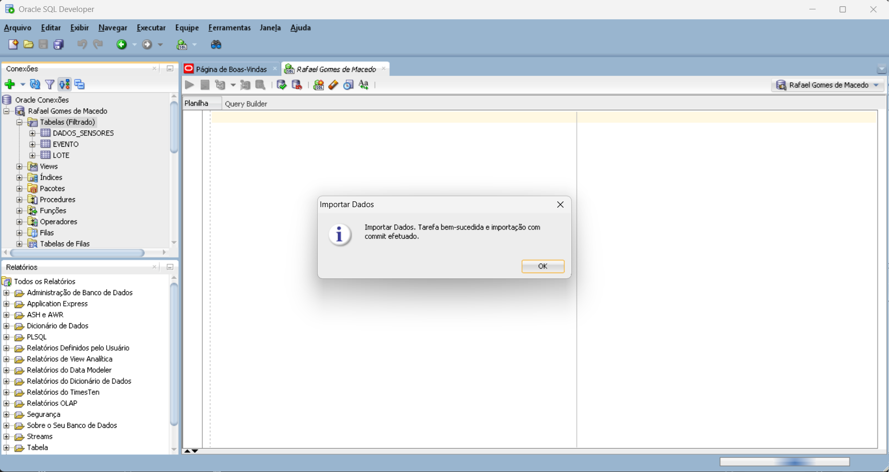
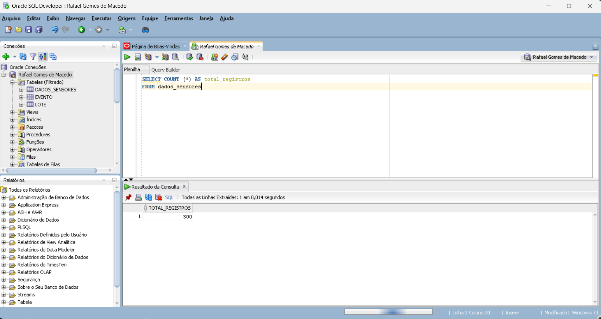
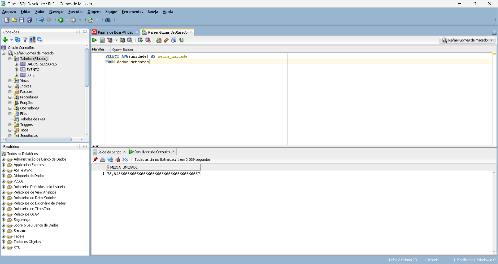
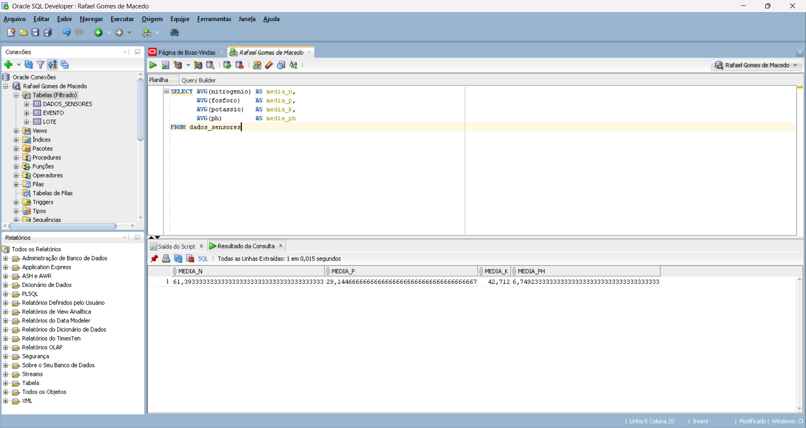
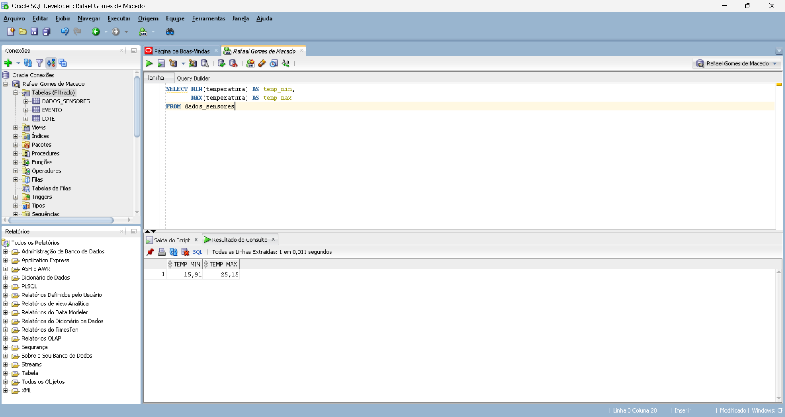
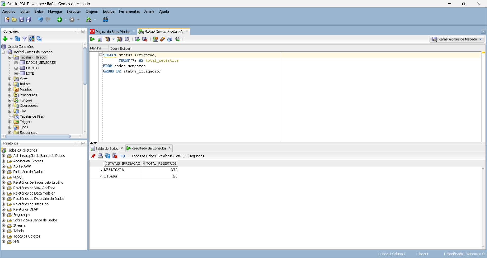
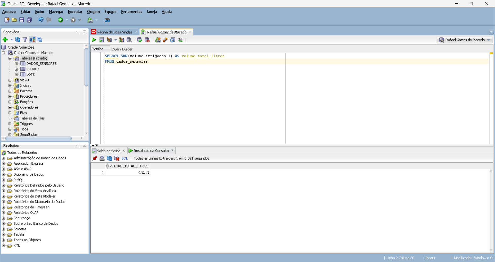

# FIAP - Faculdade de Informática e Administração Paulista

## Sistema de Irrigação Inteligente

## 👨‍🎓 Integrantes:
- Rafael Gomes de Macedo (RM566955)

## 👩‍🏫 Professores:

### Tutor(a):
- Sabrina Otoni
### Coordenador(a):
- André Godoi

# Fase 3: Banco de Dados dos Sensores
  
O objetivo desta etapa é importar para o banco de dados Oracle os dados capturados pelos sensores da lavoura (simulados na Fase 2) e realizar consultas SQL para análise inicial dos valores.

---

# 1. Contexto do Projeto

Esse projeto é uma startup fictícia criada no PBL da FIAP para simular o uso de Inteligência Artificial e IoT aplicados ao agronegócio.  
Na **Fase 2**, dados de sensores foram gerados/obtidos em um arquivo CSV.  
Nesta **Fase 3**, esses dados são importados e estruturados em um banco Oracle da FIAP, possibilitando:

- armazenamento seguro e organizado  
- consultas SQL  
- preparação para etapas futuras (Dashboard – Data Science – Machine Learning)

---

# 2. Estrutura do Repositório

Cap1_Fase3  
│  
├── dados/  
│ └── sensores_fase2.csv    
│  
├── src/  
│ └── gerar_sensores_fase2.py  
│  
├── prints/  
│ ├── importacao.png  
│ ├── select_all.png  
│ ├── count_registros.png  
│ ├── media_umidade.png  
│ ├── media_npk_ph.png  
│ ├── temp_min_max.png  
│ ├── irrigacao_groupby.png  
│ ├── volume_total.png  
│  
└── README.md  

---

# 3. Geração dos Dados (Fase 2)

Os dados utilizados nesta fase foram **simulados utilizando Python**, com geração de valores realistas para:

- umidade  
- temperatura  
- pH  
- N, P, K  
- chuva  
- status de irrigação  
- volume de água aplicado

O script utilizado está disponível em:

├── src/  
│ └── gerar_sensores_fase2.py

Este script gera automaticamente o arquivo **`sensores_fase2.csv`**, que serviu como fonte de dados na importação.

---

# 4. Importação dos Dados no Oracle

A importação foi realizada no **Oracle SQL Developer**, utilizando:

**Caminho:**  
*Tabelas (Filtrado) → Importar Dados → Selecionar CSV → Finalizar*

A mensagem de sucesso confirma que os dados foram carregados corretamente:



> *Figura 1 – Importação concluída com commit efetuado.*

---

# 5. Visualização inicial dos dados (SELECT *)

Para garantir que a importação ocorreu corretamente:

```sql
SELECT * FROM dados_sensores;
```


> *Figura 2 – Primeiros registros carregados no banco.*

---

# 6. Consultas SQL Realizadas

## 6.1 Contagem total de registros

```sql
SELECT COUNT(*) AS total_registros
FROM dados_sensores;
```

> *Figura 3 – Total de 300 registros importados.*

## 6.2 Média de Umidade

```sql
SELECT AVG(umidade) AS media_umidade
FROM dados_sensores;
```

> *Figura 4 – Média geral da umidade registrada pelos sensores.*

## 6.3 Média de Nitrogênio, Fósforo, Potássio e pH

```sql
SELECT 
    AVG(nitrogenio) AS media_n,
    AVG(fosforo)    AS media_p,
    AVG(potassio)   AS media_k,
    AVG(ph)         AS media_ph
FROM dados_sensores;
```

> *Figura 5 – Médias dos principais indicadores químicos do solo.*

## 6.4 Temperatura Mínima e Máxima

```sql
SELECT 
    MIN(temperatura) AS temp_min,
    MAX(temperatura) AS temp_max
FROM dados_sensores;
```

> *Figura 6 – Variação de temperatura ao longo das medições.*

## 6.5 Registros de irrigação (Ligada/Desligada)

```sql
SELECT status_irrigacao,
  COUNT(*) AS total_registros
FROM dados_sensores
GROUP BY status_irrigacao;
```

> *Figura 7 – Quantidade de registros com irrigação ativa ou inativa.*

## 6.6 Volume total de água aplicado

```sql
SELECT SUM(volume_irrigacao_l) AS volume_total_litros
FROM dados_sensores;
```

> *Figura 8 – Volume de água aplicado ao solo durante o período monitorado.*

---

# 7. Conclusão

Nesta fase, realizamos:
- a importação estruturada dos dados de sensores para o Oracle;
- a validação da base, garantindo que todos os registros foram carregados corretamente;
- a execução de consultas SQL que permitem compreender o comportamento do solo e da irrigação;
- a criação de uma base sólida para análises estatísticas, dashboards e outras aplicações futuras.

---

# 8. Vídeo de Demonstração
 
👉 [LINK DO VÍDEO](https://youtu.be/K2b8WefPjuk)
